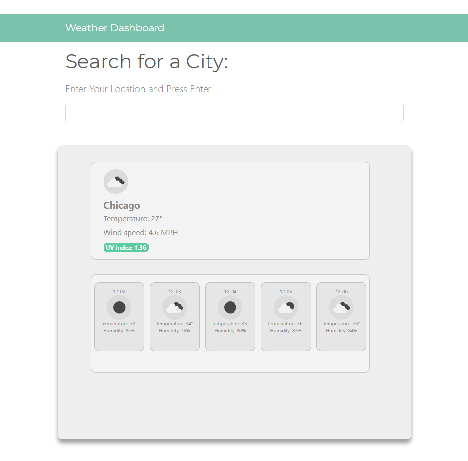

# Weather Dashboard

The weather is always considered when travelling anywhere around the world or even to the nearest subarb. Retrieving data from the OpenWeather API allows for weather data in various cities to run on the browser and will let any traveler plan their trip accordingly! 

## At a Glance

## Built with
* [OpenWeather API](https://openweathermap.org/api)
* JavaScript
* HTML
* [Bootstrap](https://getbootstrap.com/)
* CSS
* [Github](https://github.com/)

## Deployed Link
[Weather Dashboard](https://fevia.github.io/weather-dashboard/)